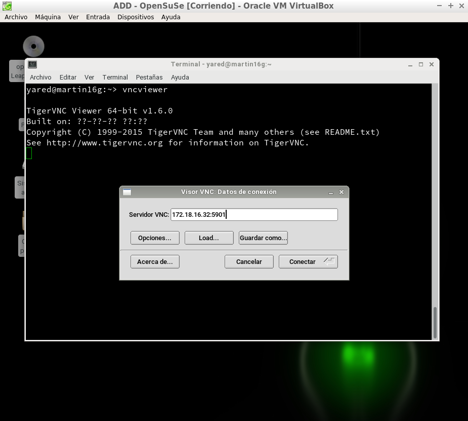
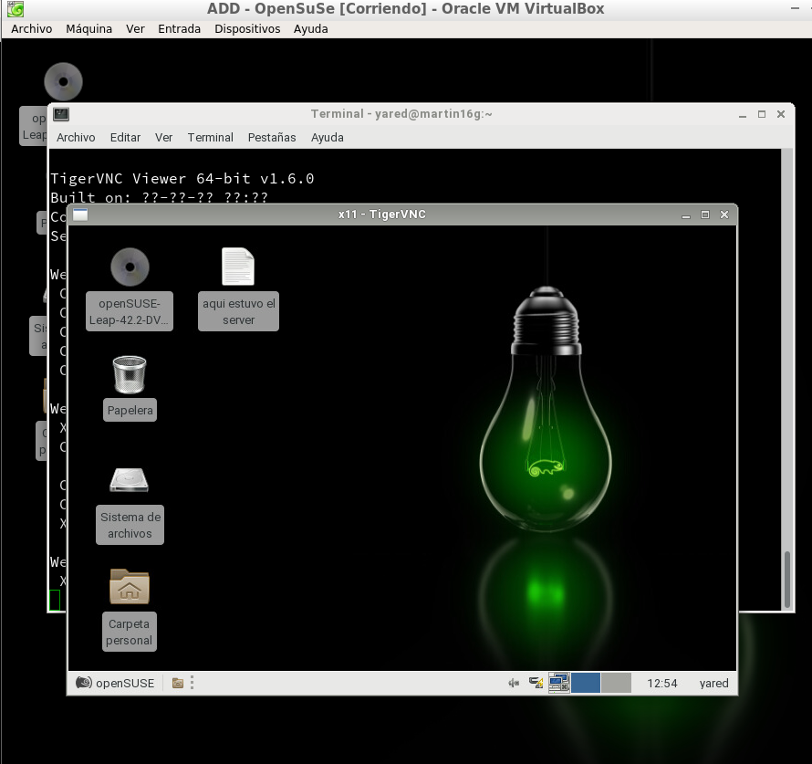

# Conexiones remotas con VNC

## Instalación en Windows
___

*Empezamos con la instalación de TightVNC en el servidor Windows*

>Como se ve en la imagen, en el servidor solo se instala el server

*Ahora lo instalamos en el cliente, esta vez solo el viewer al ser el cliente*

*Una vez instalado en los dos solo falta hacer la prueba de conexión desde el cliente al servidor*

## Instalación en OpenSUSE
___

*Empezamos configurando en el servidor el VNC desde Yast. En este caso ya viene instalado por defecto*

 *En este caso, como en windows, le damos al servidor la capacidad de ejercer cambios en el cliente*

*Ahora en el cliente hacemos lo mismo, salvo cambiando el primer paso*

___

*Una vez instalado tanto en el cliente como en el servidor, probamos la conexión*

> En este caso hay que añadir :5901 ya que en este caso es el puerto destinado a VNC

*Al darle a conectar veremos como controlamos el otro pc*

>Cree el archivo "aqui estuvo el server" como prueba de la conexión. Aquí se ve como si cerramos la sesion y vamos al cliente, el archivo está en el escritorio

*Ahora lo haremos a la inversa, desde el cliente nos conectamos al server*

>Hacemos la misma prueba para ver si funcionó y vemos que si

___

#### Conexión entre distintos SO

*Para terminar comprobaremos la conexión desde OpenSUSE a Windows*

>Vemos como se ve en las dos pantallas y además se puso en negro el escritorio
