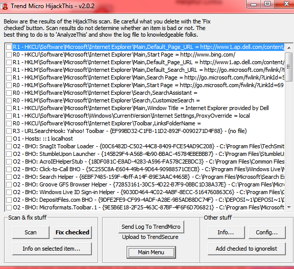

# Atenuando efectos +

## 1.- Instala y utiliza la herramienta de análisis antimalware Live AVG Rescue CD que se puede iniciar desde un CD o flash USB. Documenta dicho proceso.

##### Empezamos descargando el programa y lo instalamos en un usb booteable. Tras esto, reiniciamos el pc y activamos el inicio desde ese USB:

##### Una vez iniciado seleccionamos Quick Scan para hacer un analisis rapido de archivos:

##### Cuando nos lo pida, seleccionamos la partición a analizar:

##### Y comprobamos el resultado:

## 2.- Realiza un análisis de malware con las herramientas y servicios gratuitos de Micro Trend . Usa las herramientas: HouseCall, Browser Guard, HiJackThis, RUBotted. Documenta los procesos.

### HouseCall:

##### HouseCall es un explorador muy conocido y eficaz de Trend MicroTM disponible bajo petición que identifica y elimina virus, troyanos, gusanos, complementos del explorador no deseados y otro tipo de malware.

### Browser Guard:

##### Browser Guard se trata de una extensión para los navegadores Google Chrome, Mozilla Firefox e Internet Explorer.

## HiJackThis:

##### Es una pequeña herramienta gratuita que escanea rápidamente el sistema Windows para encontrar las modificaciones que puedan haber sido realizadas por algún Spyware, Browser Hijacker, Malware u otro programa malicioso.

## RUBotted:

##### Los botnets están ganando terreno. A medida que más control toman de ordenadores y hacen uso de estas máquinas infectadas para actos criminales, las redes de bots son cada vez más resistentes. La aparición de nuevas familias de bots y la continua proliferación de algunas de las botnets más conocidas del panorama de las amenazas sólo refuerzan la necesidad de una solución fiable contra botnets. Proteja su equipo en busca de infecciones y actividades sospechosas con RUBotted.

