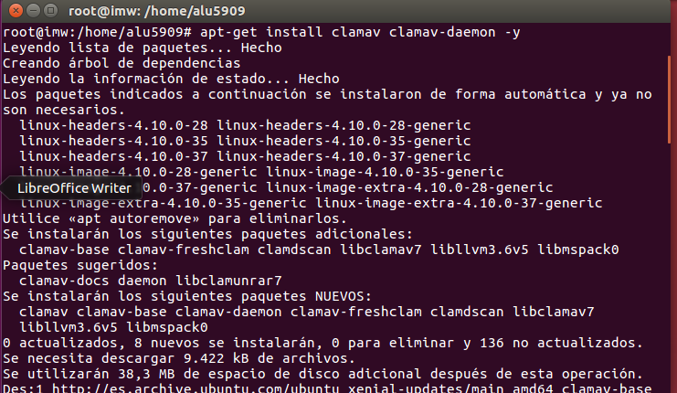
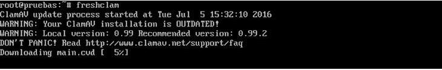
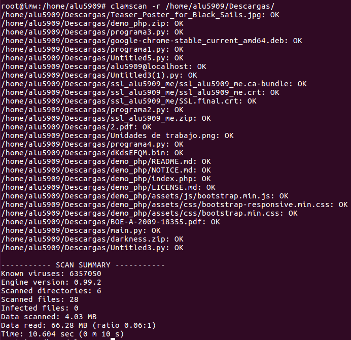
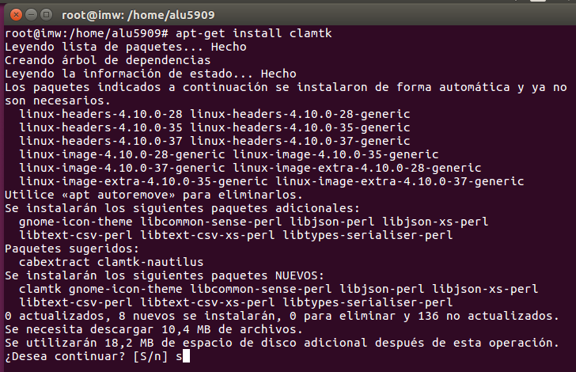
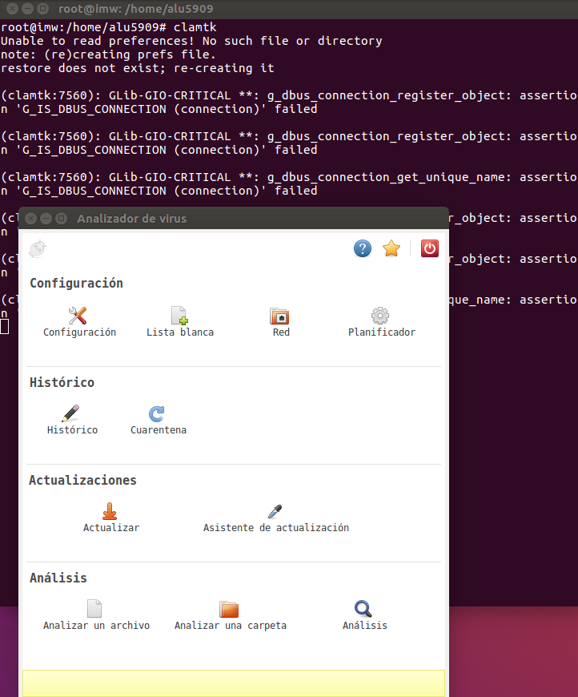
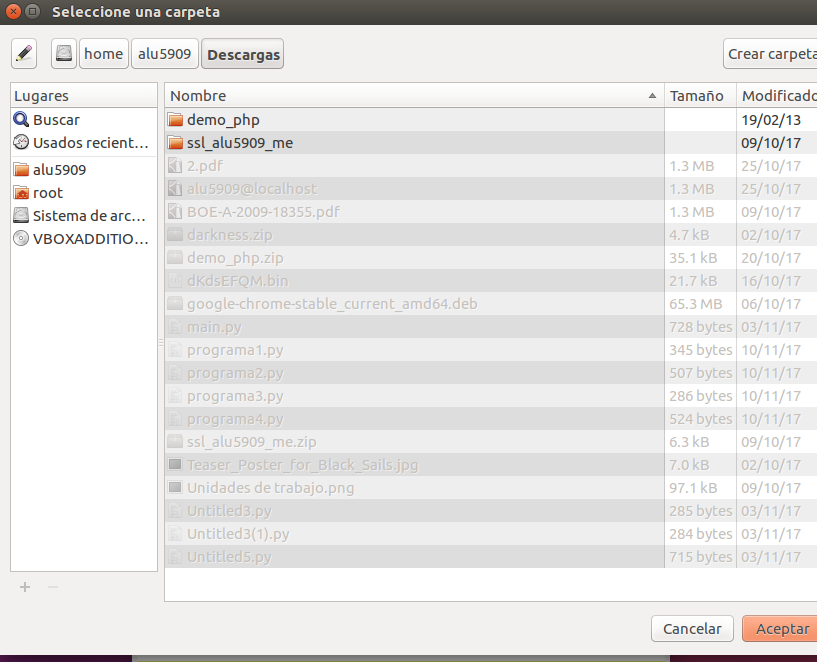
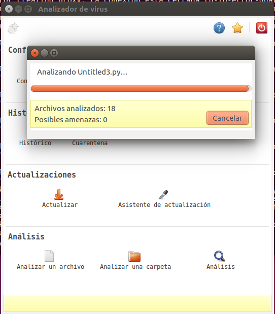
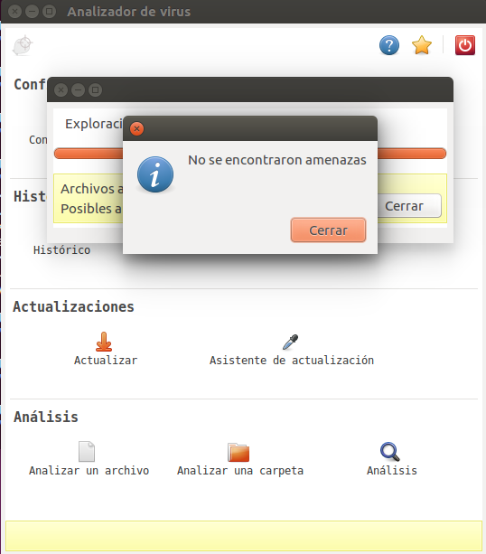
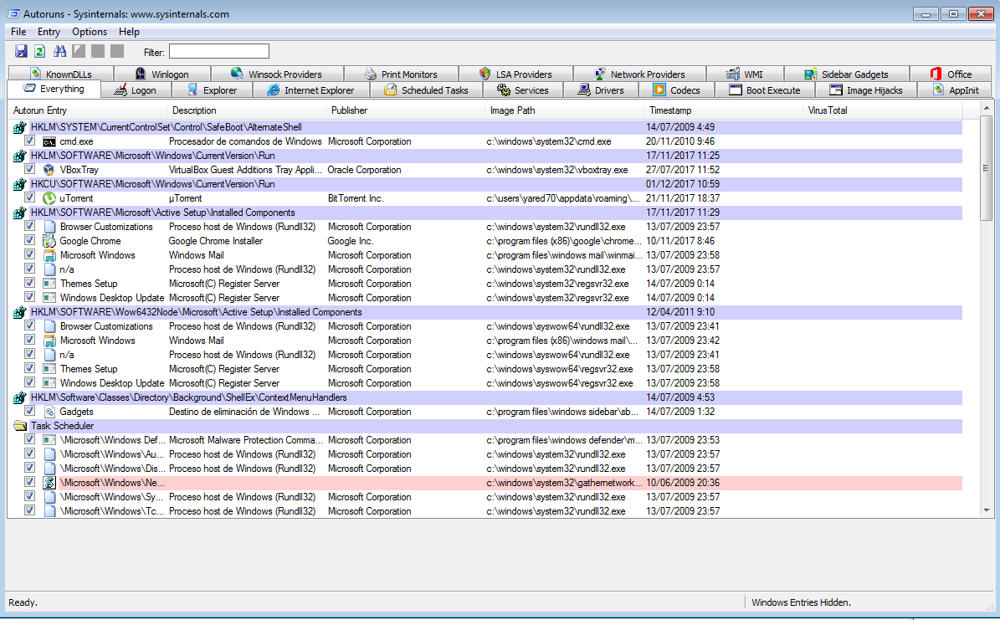

# Atenuando Efectos

## Instala en Linux antivirus clamav (versión consola) y clamtk (versión gráfica). Deja constancia de su uso, tanto a nivel gráfico como de consola

### Clamav versión consola

##### Lo instalamos con apt-get en modo superusuario

##### Lo actualizamos:

##### Escaneamos la carpeta Descargas mediante consola:

> Aqui vemos que no encuentra ningun virus

## CLAMTK version gráfica

##### Lo instalamos con apt-get por igual que la version de consola

##### Lo abrimos y seleccionamos la carpeta a analizar en este caso la de Descargas

##### Y vemos que igual que usando la versión de consola, no encontró amenazas

## SYSINTERNALS suite

##### Descargamos e instalamos la aplicación:

https://docs.microsoft.com/en-us/sysinternals/downloads/sysinternals-suite

##### Comprobamos el funcionamiento:

