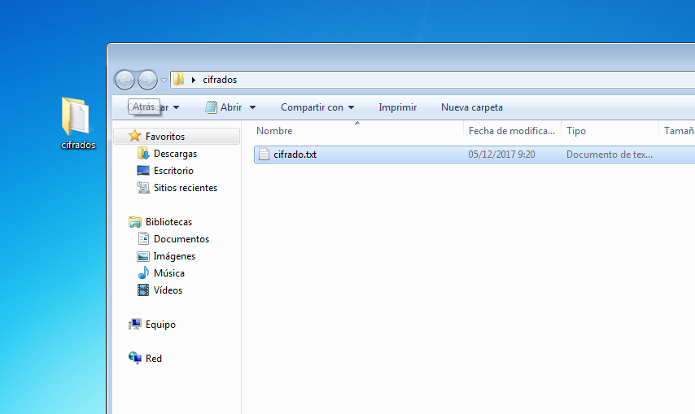
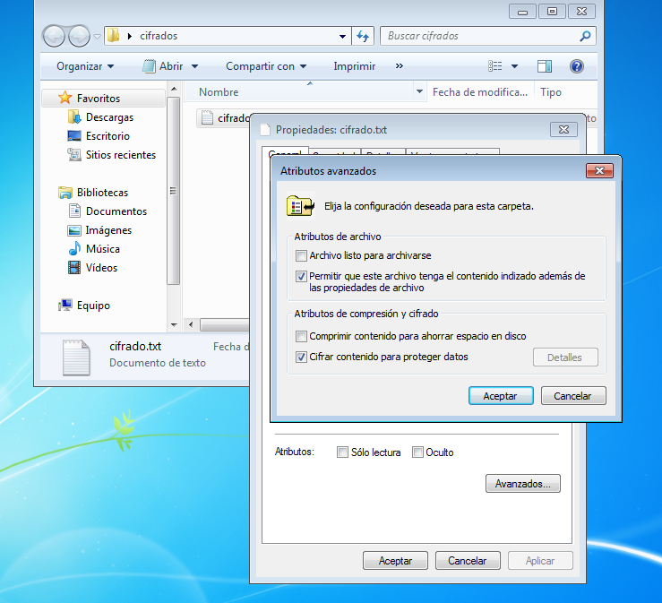
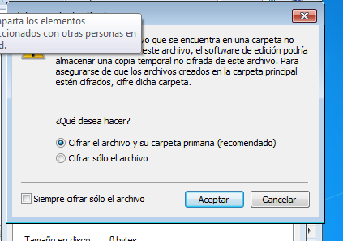
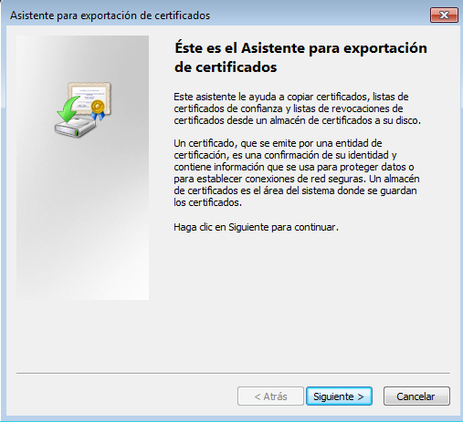
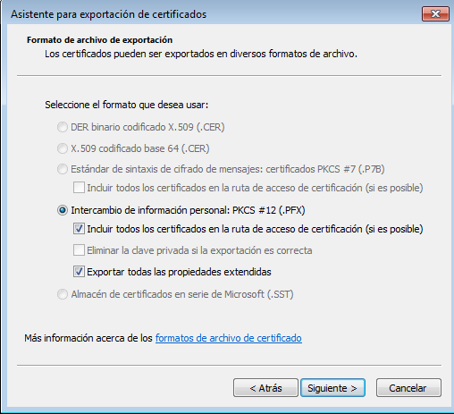
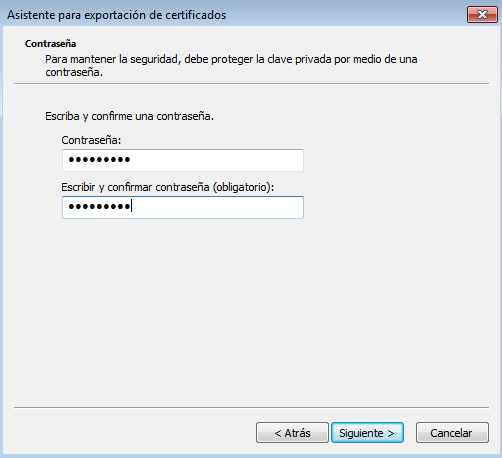
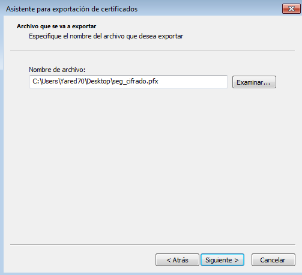
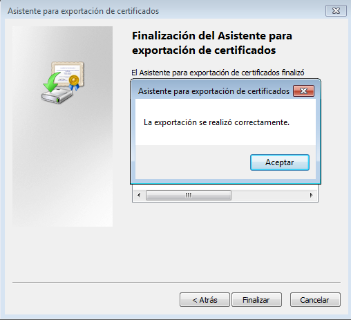
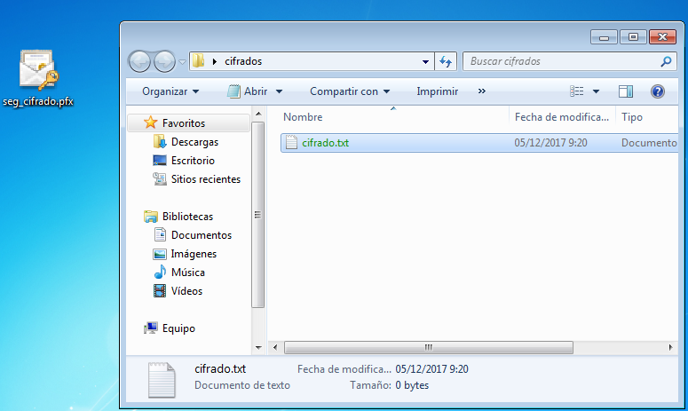

# Sistema de cifrado de archivos. Encrypting File System (EFS)

### Empezamos creando la carpeta y los archivos a cifrar

### Ahora damos clic derecho al archivo o la carpeta y vamos a opciones avanzadas. Ahí nos saldrá la opción de cifrado

### Aceptamos y seleccionamos que queremos cifrar

### Al aceptar y aplicar los cambios, nos aparecerá una ventana para crear una copia de seguridad

### Le damos a siguiente y configuramos la copia

### Durante la creación de la copia, nos pedirá contraseña (en este caso seguridad) y donde guardar el certificado

### Al terminar vemos como el archivo cifrado cambia de color a verde para distinguirlo de los no cifrados

## Segunda Actividad

### Averigüe las diferencias entre: la clave de agente de recuperación de EFS y el certificado. O lo que es lo mismo entre el archivo .pfx (que contiene el certificado y una clave privada) y un archivo .cer (que contiene sólo el certificado). Cuando utilizar uno u otro.

> Los archivos .cer y .crt son formatos de exportación de clave pública de certificados y .pfx es lacopia de seguridad con clave privada de un certificado (exportado desde el Internet Explorer).
