# VOIP en Windows

#### Yared Martin Perez y Pablo Viera Martin

## Instalación del PBX 3CX Phone System en el servidor

*Instalamos el PBX 3CX Phone System en el servidor siguiendo las siguientes características:*

- Seleccionar extensiones de 3 dígitos y configuración regional adecuada.

- Configurar los datos del usuario operador.

- Seleccionar países con los que se podrá establecer comunicación.

- Comprobar funcionamiento correcto entrada DNS.

- Crear, al menos, tres extensiones correspondientes   a diferentes usuarios con toda su información.

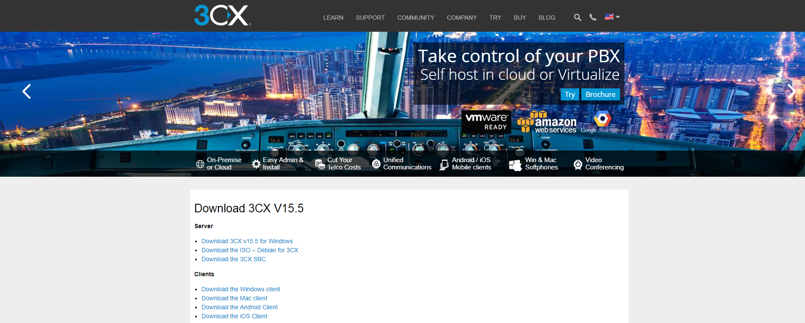

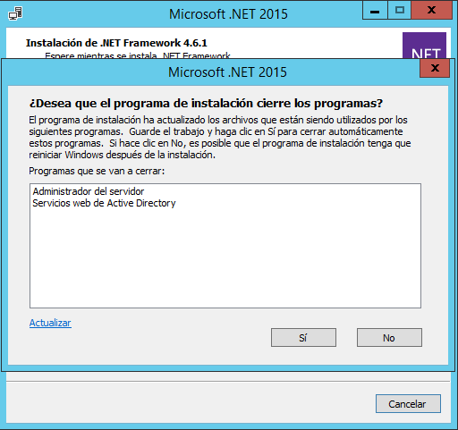

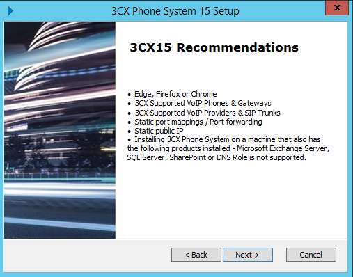

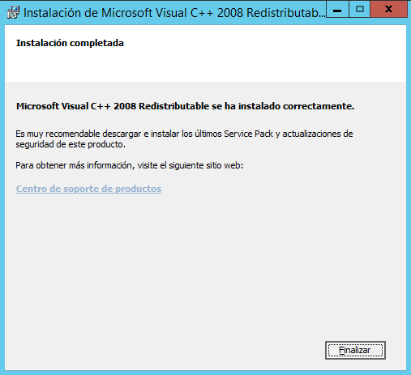

*Nos aseguramos de que esta sea nuestra ip publica*

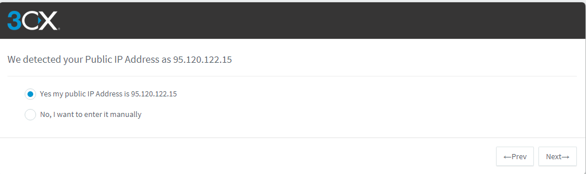

*Elegimos nombre de dominio para la web*

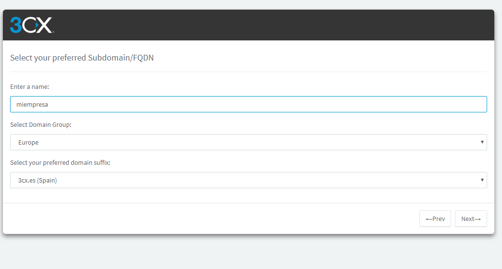

*Configuramos los puertos. En este caso usamos los de por defecto*

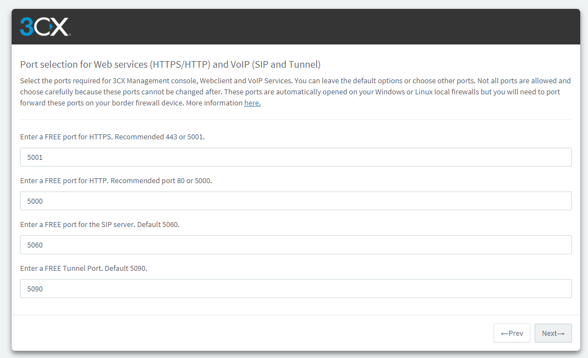

*Elegimos la ip o creamos una nueva con otro dominio*

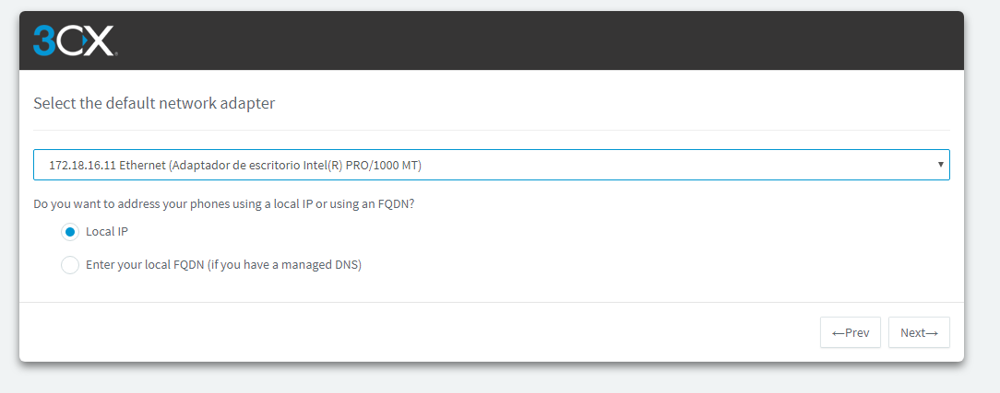

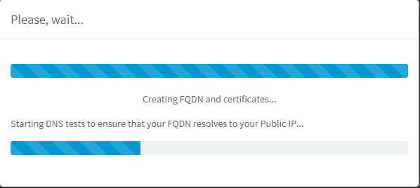

*Elegimos extensión de tres digitos como se pedía en la actividad*

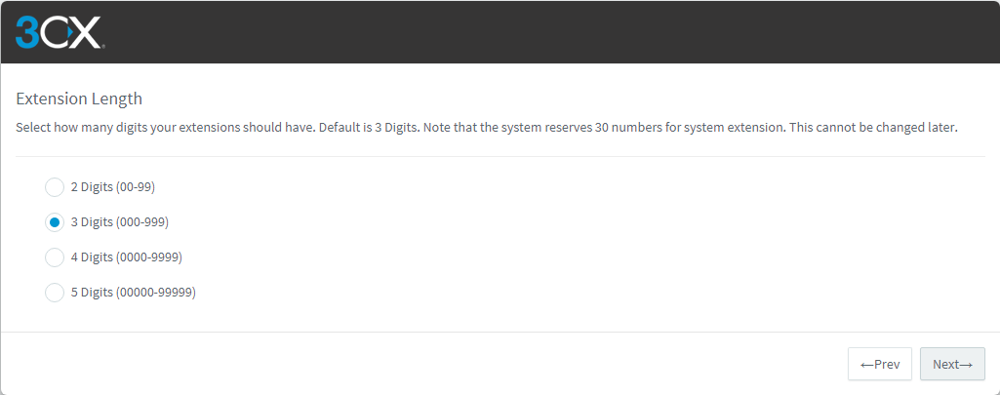

*Selecionamos nuestra zona geográfica*

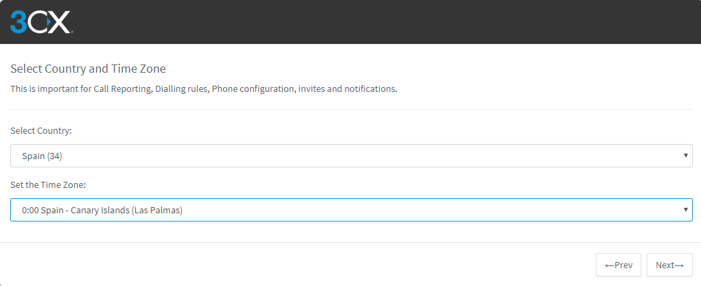

*Añadimos el primer operador*

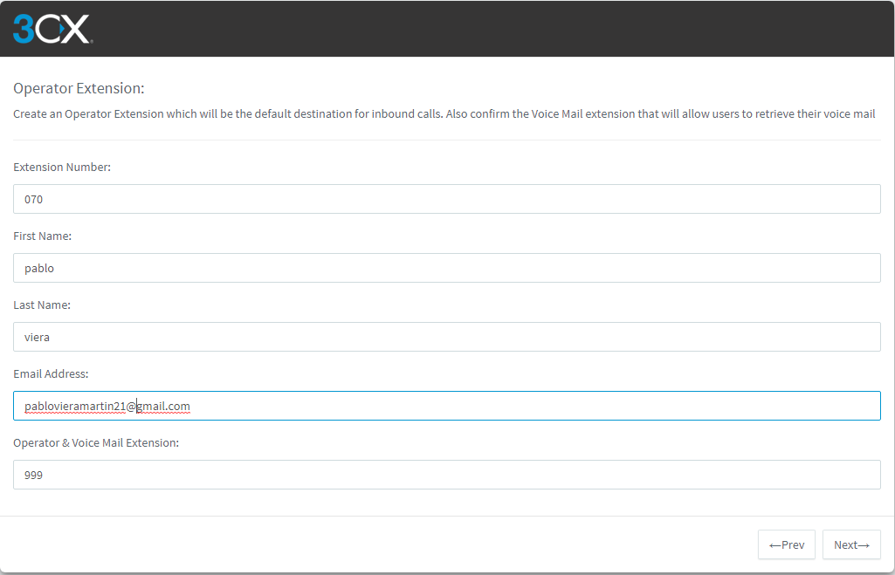

*Elegimos desde donde pueden llegar y hacerse las llamadas:*

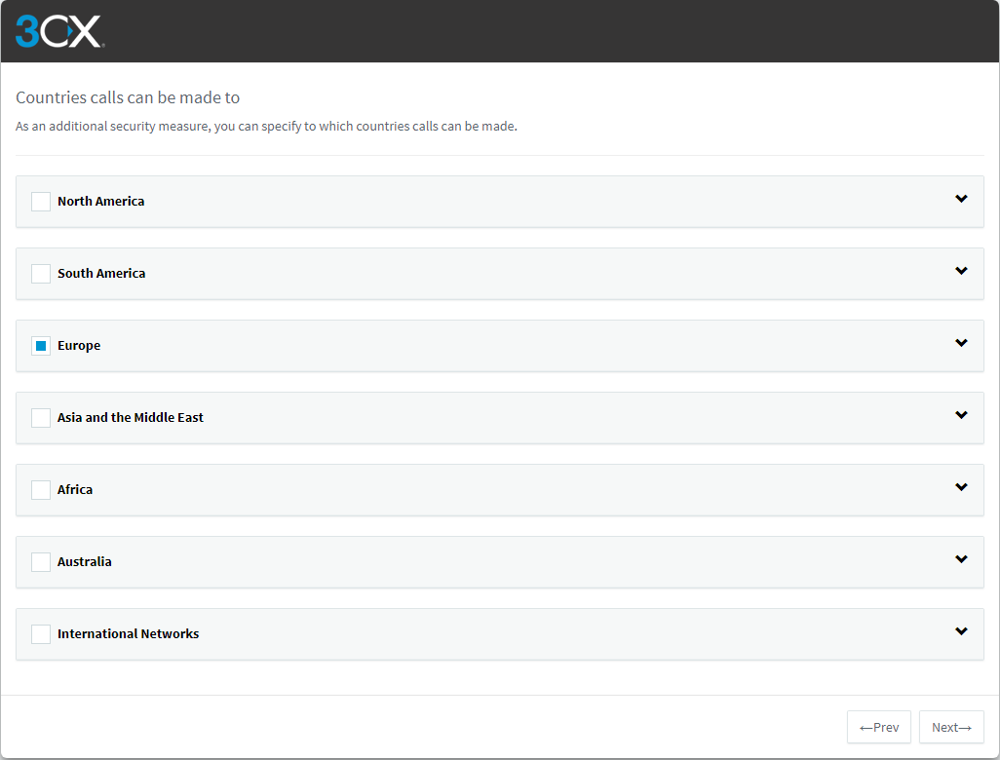

*Elegimos el idioma:*

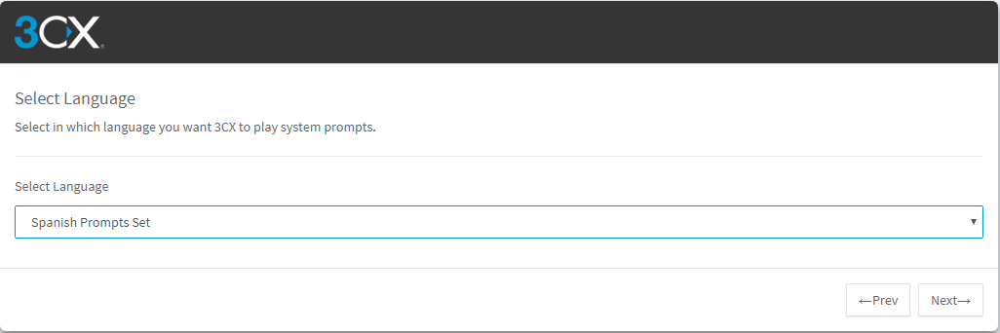

*Rellenamos los datos del admin*

*Con esto terminamos de configurarlo y accedemos al panel web*

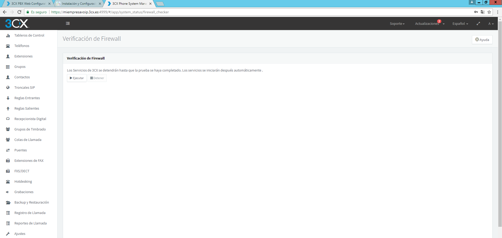

*Ahora descargaremos el softphone 3CX Phone tanto en cliente como en el servidor*

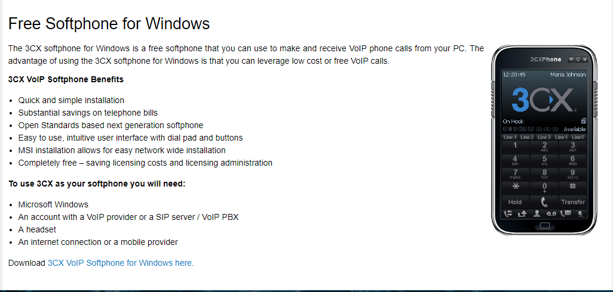

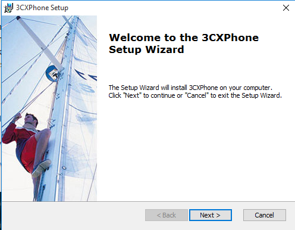

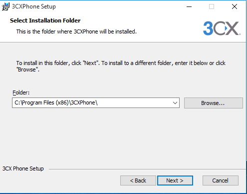

*Ya instalado lo iniciamos y creamos un nuevo profile con los datos de alguno de los creados en la web*

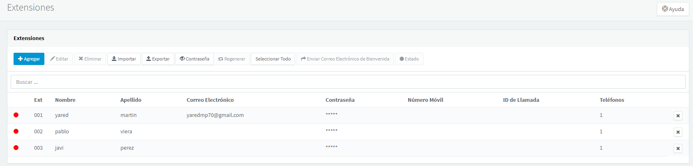

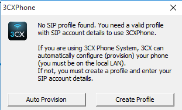

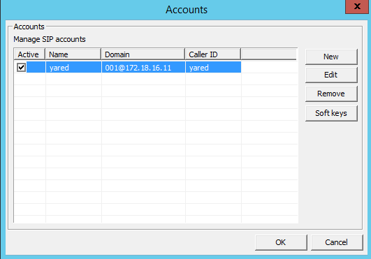

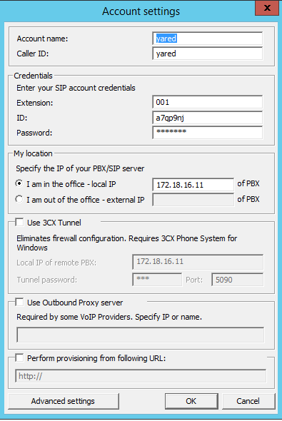

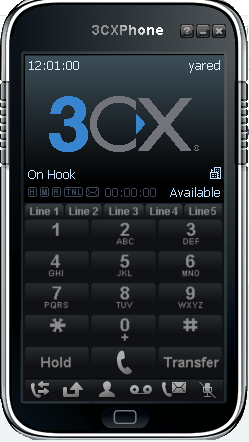

*Comprobamos que se activó en la web*

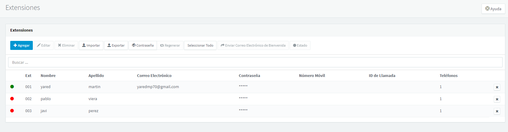

*Ahora vamos al cliente y tras instalar el 3cx comprobamos si funciona*

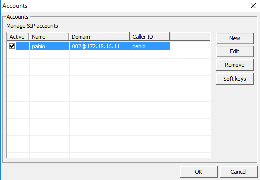

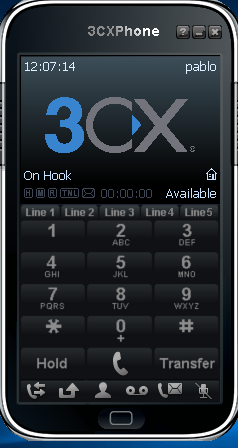

*Y por ultimo probamos a llamar el uno al otro:*

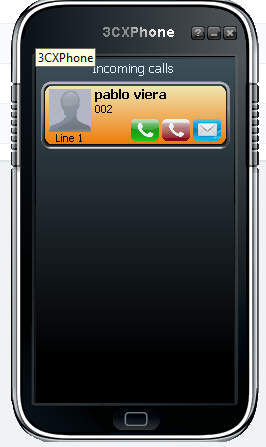

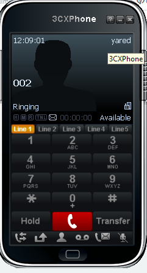

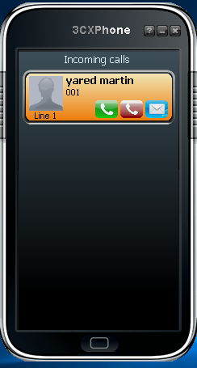
