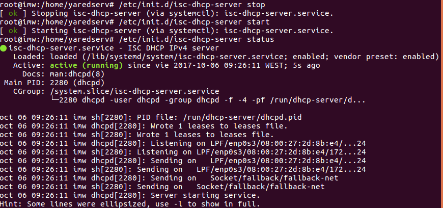
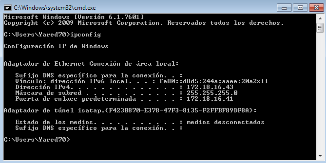

# Instalación de un servidor DHCP en Linux

#### Crear un manual de instalación y configuración de un servidor DHCP en una máquina Linux

*Empezamos instalando el isc-dhcp-server en el servidor Linux usando el apt-get*

*Una vez instalado nos vamos al archivo de configuración del DHCP para crear el ámbito. El archivo a editar es el: /etc/dhcp/dhcpd.conf*

>En option routers ponemos la ip de nuestro servidor ya que será el que de acceso a internet.

> En option domain-name-servers ponemos el de google ya que de momento no crearemos un servidor dns

*Ahora nos paramos e iniciamos el servidor dhcp para que se actualize la información*

> Como se ve en la captura, el inicio salió bien. En caso de que saliera failure habría que ir al /var/log/syslog

*Una vez iniciado eCrear un manual de instalación y configuración de un servidor DHCP en una máquina Linux.l servidor DHCP nos vamos a la máquina cliente y comprobamos que está puesto en DHCP y como nos coge la ip dentro del rango que asignamos en el servidor*

*Una vez comprobado que funciona, crearemos una reserva por MAC modificando el dhcpd.conf*

> En este caso, en hardware ethernet ponemos la mac del cliente, y en fixed-address la direccion que queremos que tenga

*Para terminar, cogeremos una máquina windows. le pondremos red interna y comprobamos como el servidor dhcp en linux también le da servicio al cliente windows*

