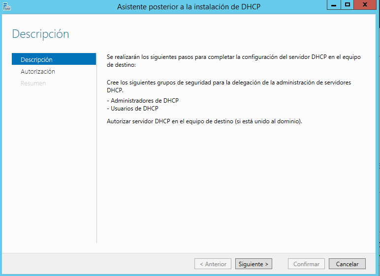
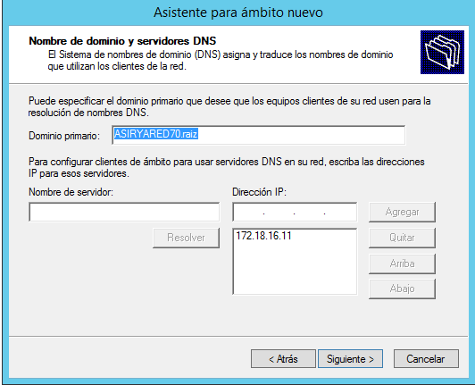
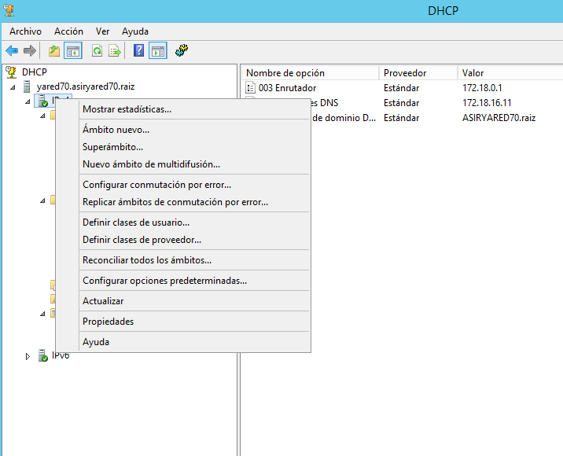
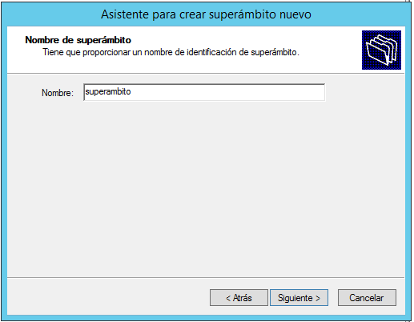

# Instalación de un servidor DHCP en Windows

#### Crear un manual de instalación y configuración de un servidor DHCP en una máquina con Windows Server.

*Empezamos instalando el DHCP en el windows server. Para esto nos vamos a activar roles y caracteristicas y buscamos el DHCP*

*Ahora, una vez instalado el DHCP vamos a crear un ámbito. Para esto en el panel del servidor, nos vamos a herramientas y a DHCP.*

*Una vez aqui, nos vamos a crear ámbito como se ve en la imagen*

*El ámbito lo configuramos dependiendo de la ip que tengamos en el servidor y los rangos que queramos asignar*

*Ahora crearemos un segundo ámbito*

> El segundo ámbito lo crearemos en la misma red, pero se puede crear en otra si se posee mas de una tarjeta de red instalada

*Ahora que tenemos los dos ámbitos creados, los todos en un superámbito*

*Una vez creado el superámbito, nos vamos al ámbito 1 para crear una reserva por MAC del cliente*

*Ahora nos vamos al cliente y comprobamos si funciona*

>Aquí vemos que el cliente tiene por dhcp la ip que le asignamos en la reserva

*Ahora como prueba final, nos vamos al servidor y desactivamos el superámbito. Al hacerlo comprobaremos como el cliente no obtiene ninguna dirección por dhcp*

>Aquí vemos como se nos da la dirección 169.254.114.53 que es una predefinida que nos da el dhcp si no puede obtener una correcta. Esto se ve en que no tenemos una puerta de enlace predeterminada
