# Instalación y configuración de un servidor DNS

#### Se piden las siguientes acciones de configuración y prueba del funcionamiento del servicio:

> * Crear una zona de búsqueda directa para tu servidor.
> * Crear una zona de búsqueda inversa para tu subred.
> * Configurar reenviadores DNS

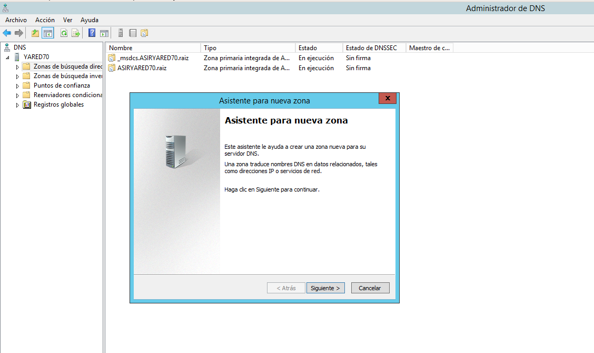

    Seleccionamos crear una zona directa e inversa

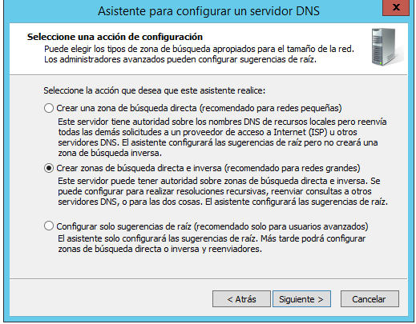

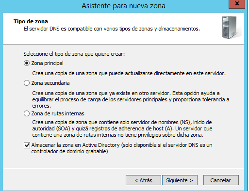

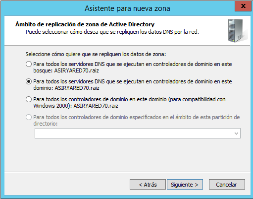

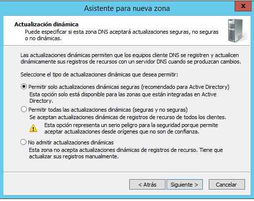

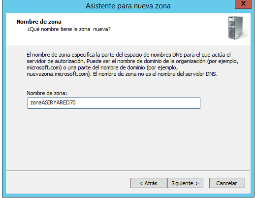

    Creación de la zona interna

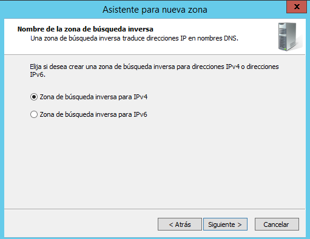

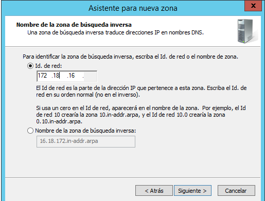

Aqui configuramos los reenviadores

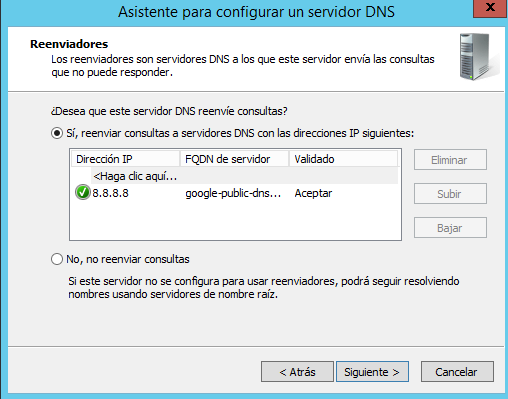

> Una vez hecho esto, en el cliente asignamos al server como dns y comprobamos su funcionamiento

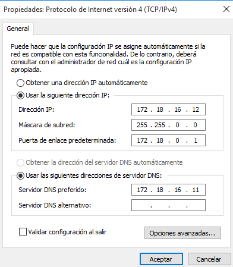

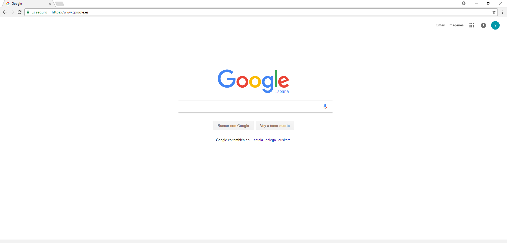

**En la zona de búsqueda directa añadir los siguientes registros:**

> * Un alias para tu servidor denominado server.
> * Una impresora con IP fija denominada printer (no hace falta alias).
> * Un servidor de correo (ficticio) denominado correo, asociado a una dirección en tu servidor.
> * Crear una subzona denominada servicios (dominio nuevo) y agregar a ésta un servidor ftp (asociado a la misma IP del servidor), una impresora nueva (con una IP fija) y el equipo del administrador del sistema (también con IP fija).

* **Server**

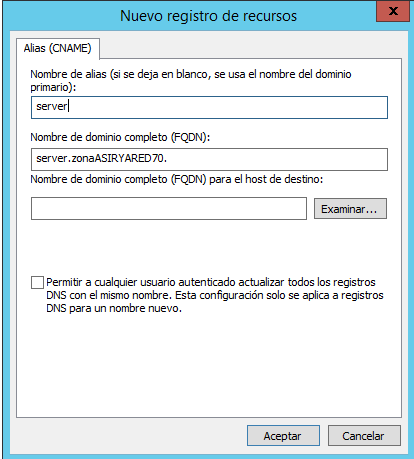

* **Printer**

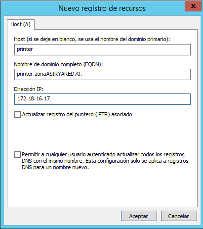

* **Servidor**

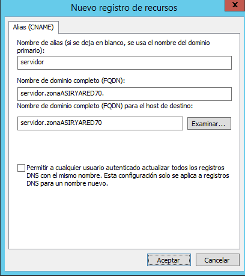

* **Nuevo dominio: servicios**

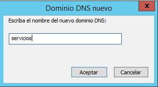

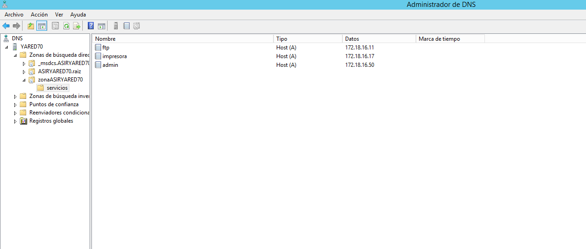

> * Comprobar que se resuelven los nombres desde la consola del servidor.

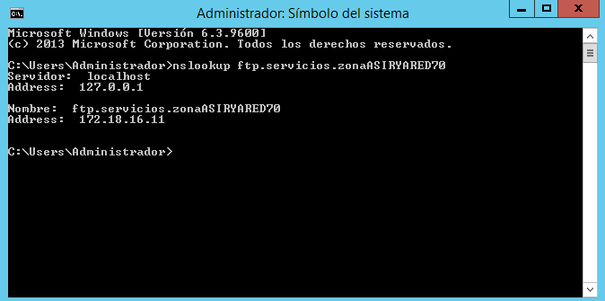

> * Validar un cliente en el dominio y comprobar que el nombre de su equipo aparece en la zona de búsqueda del servidor como un nuevo registro A

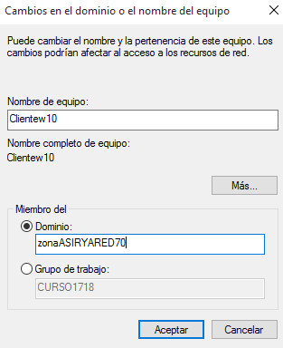

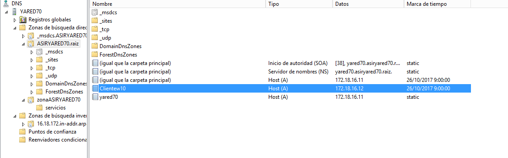

> * Realizar, también desde el cliente, algunas operaciones con nslookup

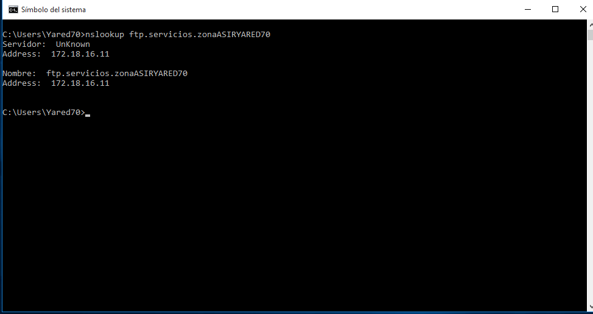

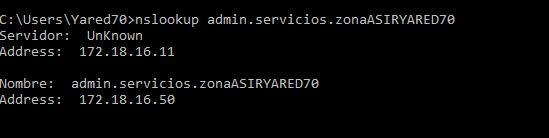
