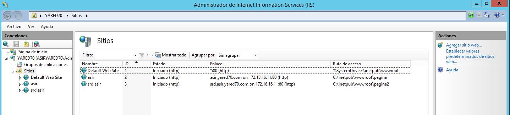
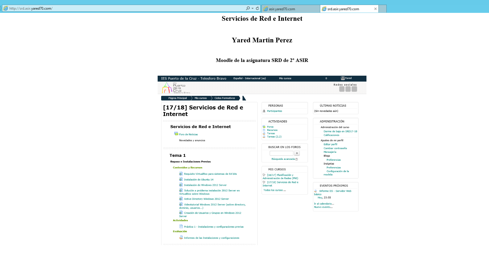

# Instalación, Configuración y Creación de Sitios Web

#### Instalacion del ISS con autenticación básica y de Windows

#### Comprobamos el acceso a nuestro servidor web (localhost)

#### Comprobamos desde el cliente

#### Comprobamos el acceso usando un alias o host asignado en el servidor DNS

#### Añadimos el host www. en el servidor dns y Comprobamos

#### Creamos un index.html y lo colocamos en C:\Inetpub\wwwroot

#### Creamos varias carpetas dentro de C:\Inetpub\wwwroot y comprobamos el acceso desde www. al index

# Creación de Sitios Web Independientes

#### Creamos dos sitios web nuevos, uno asociado al dominio principal y otro a un subdominio

##### En este caso creamos un nuevo dominio raiz llamado asir y un subdominio llamado SRD cada uno con su carpeta e index.html

# Creación de Directorios Virtuales

#### Creamos un directorio virtual relacionado con el dominio anterior, en este caso asir

#### Creamos varias carpetas dentro del directorio virtual y lo configuramos para que nos muestre como examen de directorio al acceder por el navegador

> Creamos tambien en el dns los registros necesarios para que funcionen las páginas

#### Creamos un index.html para cada carpeta y comprobamos el acceso

