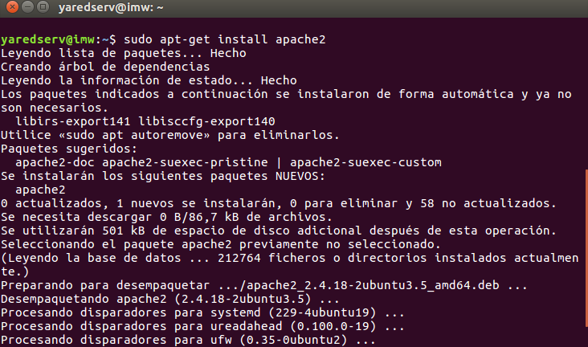
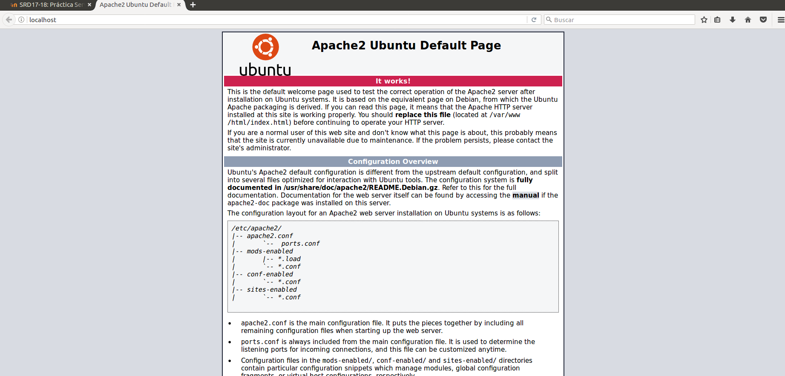
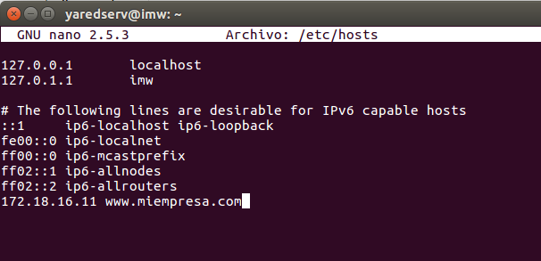
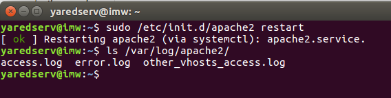
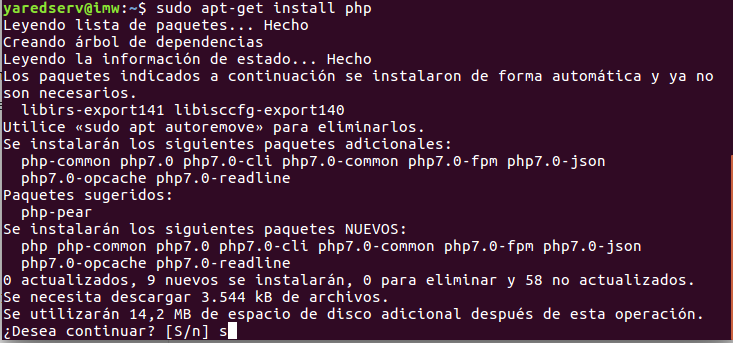
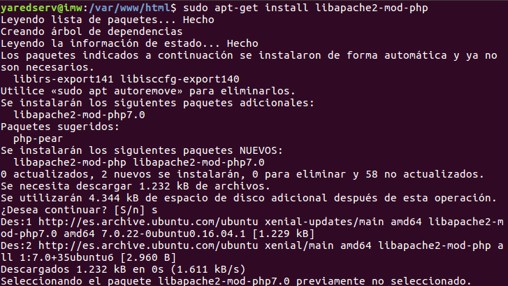
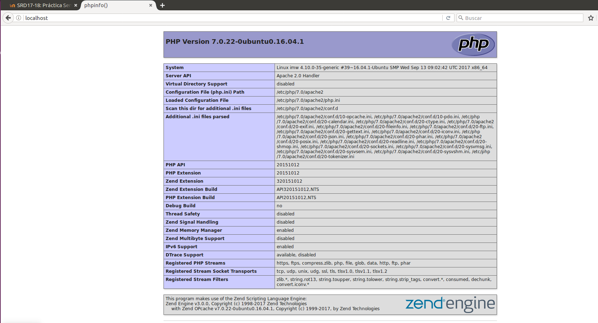
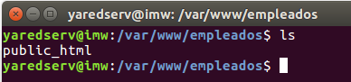
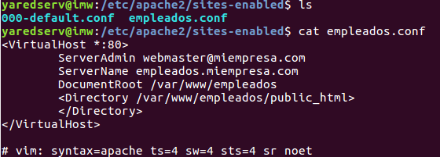
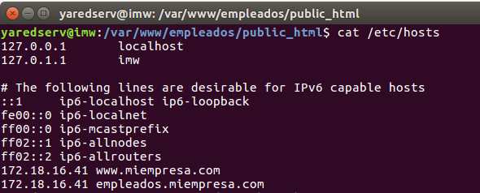

# Servidor Web Apache Linux

#### Apache

* Comenzamos instalando Apache y comprobando su funcionamiento

* Comprobamos /var/www/

* Accedemos a localhost

* Añadir línea www.miempresa.com asociada a IP servidor en /etc/hosts

* Reiniciamos Apache

#### Php

* Instalar php

* Comprobamos acceso

### Crear hosts virtuales en Apache

* Creamos una carpeta public_html para alojar el index

* Creamos el virtualhost dentro de Apache2 y creamos el enlace simbolico

