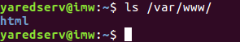
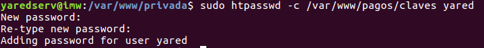

# Servidor Web Apache Linux

#### Apache

* Comenzamos instalando Apache y comprobando su funcionamiento

* Comprobamos /var/www/

* Accedemos a localhost

* Añadir línea www.miempresa.com asociada a IP servidor en /etc/hosts

* Reiniciamos Apache

#### Php

* Instalar php

* Comprobamos acceso

### Crear hosts virtuales en Apache

* Creamos una carpeta public_html para alojar el index

* Creamos el virtualhost dentro de Apache2 y creamos el enlace simbolico

* Añadimos la página al archivo etc/hosts

* Comprobamos

#### Sitios web seguros

* Empezamos creando las claves para el sitio web pagos que crearemos mas adelante

* Creamos el virtual host en sites-available

* Al comprobar vemos que funciona pero al no tener un certificado oficial nos sale esta pantalla

#### Carpetas privadas

* Empezamos creando la carpeta en /var/www/ con el nombre de la página a crear y creamos el archivo .htaccess dentro de esa carpeta

* Creamos la password para la carpeta y el usuario

* Reiniciamos el servicio

* Creamos el virtualhost

* Y comprobamos el acceso

#### Mysql y phpmyadmin

* Empezamos instalando mysql-server

* Instalamos el modulo php de Mysql

> Aquí instalabamos phpmyadmin en la carpeta del host empleados, pero al acceder desde el navegador daba error de la extensión mysqli. Tras dos días en los que se intento arreglar editando los archivos de configuración y reinstalando mysql, php y apache desde cero en clase con el profesor, no se pudo solucionar el problema, por lo que, no se pudo seguir con la actividad
