# Carpetas seguras y privadas

#### Carpetas seguras
----
* Crea una nueva zona de búsqueda directa en los servicios DNS asociado al dominio miEmpresa. Crea
también una carpeta miEmpresa en C:\ y una subcarpeta ‘principal’

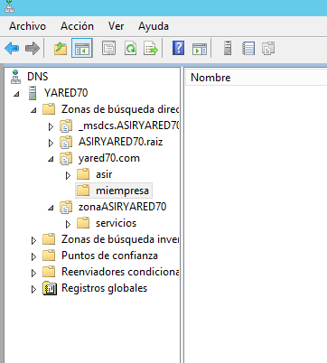

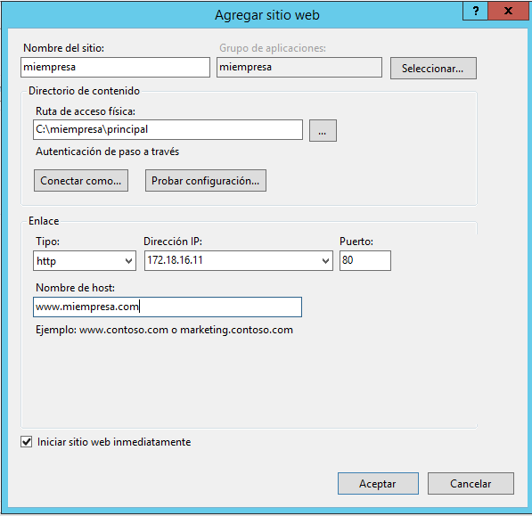

* Crea un nuevo sitio web denominado miEmpresa en IIS asociado a la subcarpeta anterior y con
acceso a través de la dirección "www.miEmpresa.com"

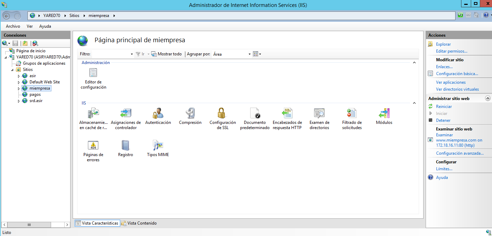

* Crea un nuevo
sitio web (denominado ‘pagos’) como subdominio de miEmpresa (pagos.miEmpresa.com) y configura
este último para ser accedido de forma segura, vía ‘https’

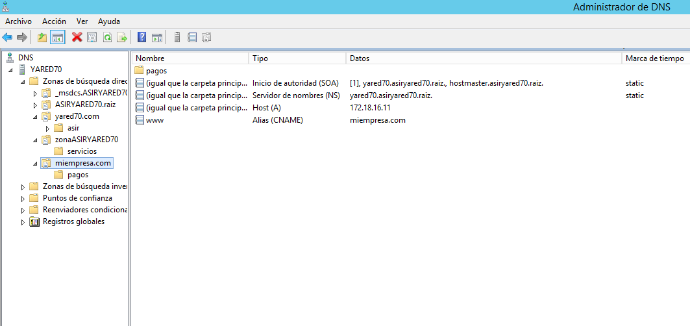

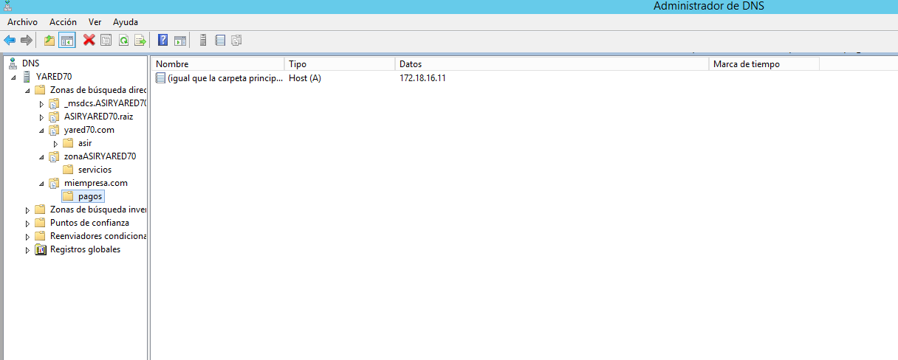

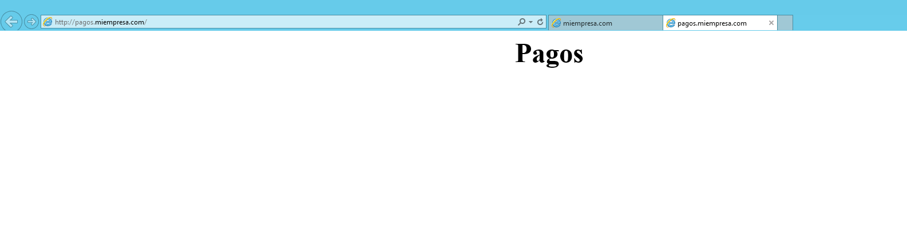

* Configura el nuevo sitio para
que se pueda acceder (sólo) como sitio web seguro (https) con un Certificado Autofirmado

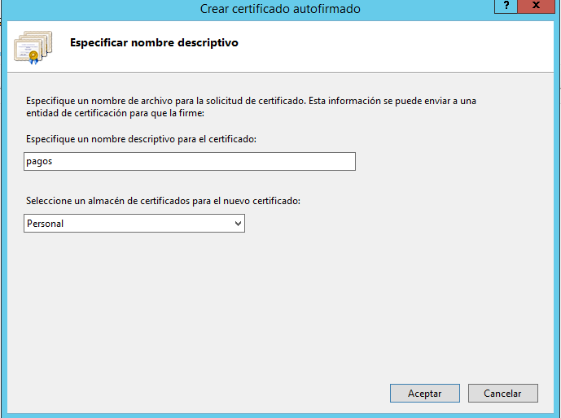

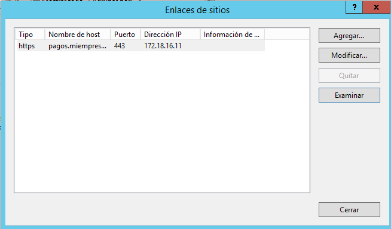

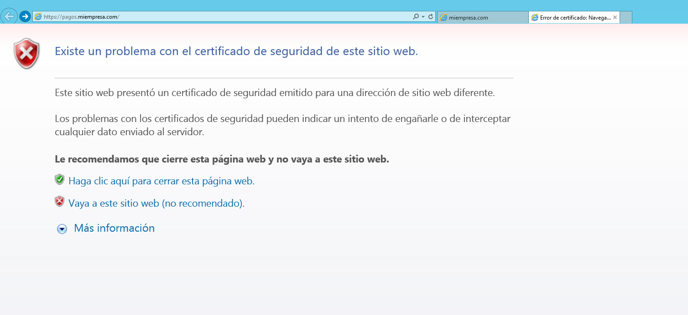

* Crearemos un nuevo sitio seguro (tienda.miempresa.com) con la generación de
un Certificado Digital a través de la aplicación OpenSSL.

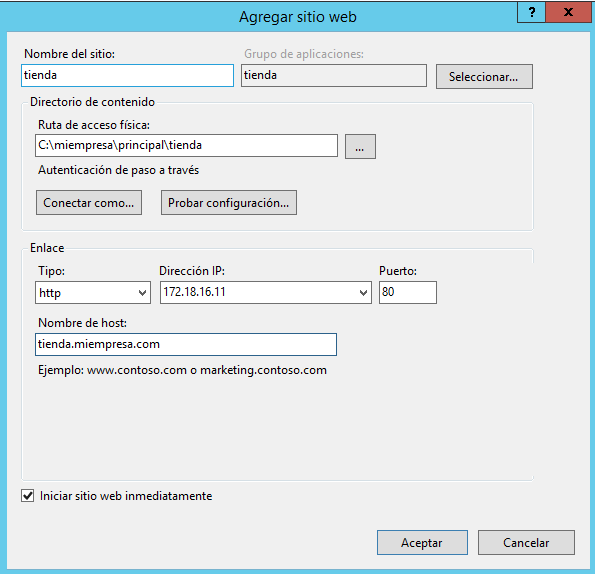

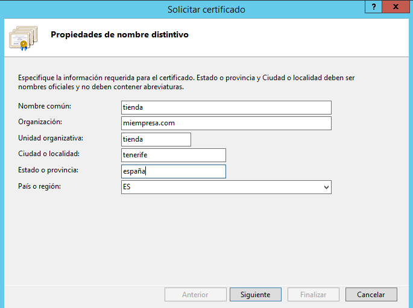

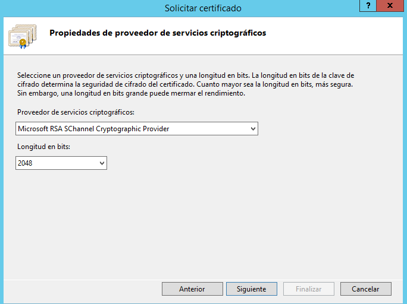

* A través de OpenSSl genera un nuevo certificado de servidor: generar una clave privada
de la entidad certificadora, crear un certificado digital de la entidad certificadora y, finalmente,
crear un certificado digital de nuestra web.

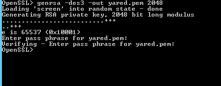

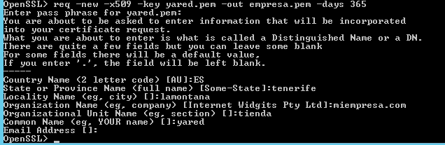

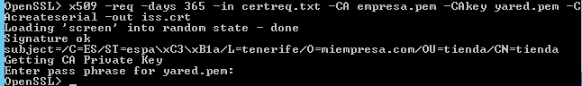

* Importar el nuevo certificado de servidor creado para completar la petición pendiente en
nuestro sitio seguro ‘pagos’.

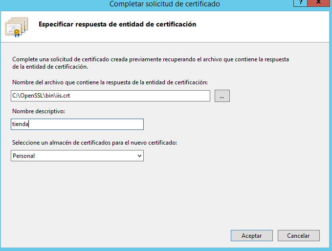

* Requerir que nuestros sitio seguros sólo se pueda acceder mediante una conexión segura

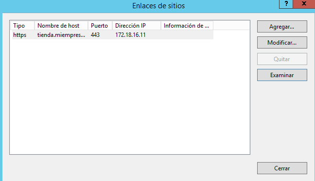

*  Acceder mediante http y mediante https a los sitios seguros desde el propio servidor y
desde un cliente W7, aceptando los posibles problemas con la entidad certificadora

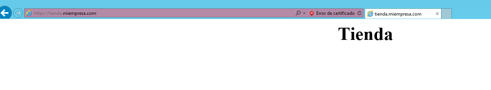

> Si accedemos por http, nos saldra la página por defecto de nuestro dominio no la configurada por https

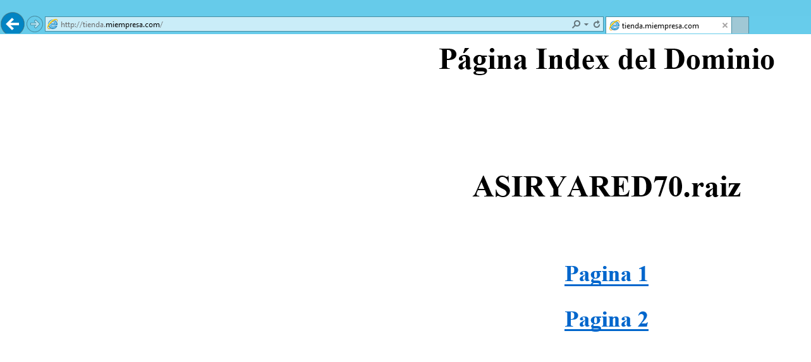

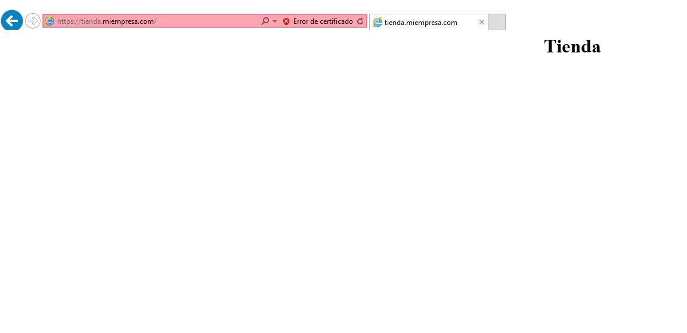

----

#### Carpetas Privadas

* Necesitamos crear una carpeta empleados (dentro de miEmpresa) y, dentro de esta, tres o
cuatro subcarpetas personales con nombres de empleados y una, denominada común, a la que
tendrán acceso todos los empleados, pero no otros usuarios sin identificar.

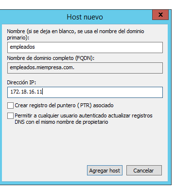

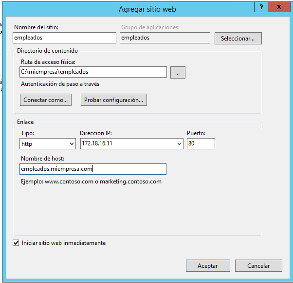

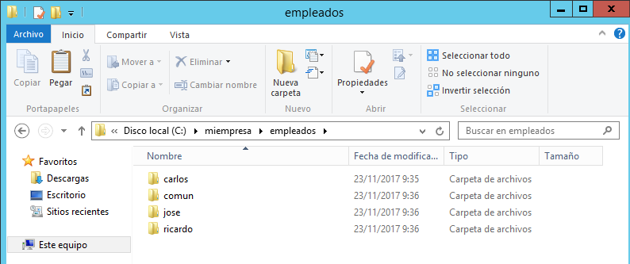

* Para el sitio web creado y para cada una de sus carpetas, deshabilitamos el acceso anónimo.
* Agregar función de Autenticación Básica a nuestro Servicio de IIS a través de la Administración
del Servidor.

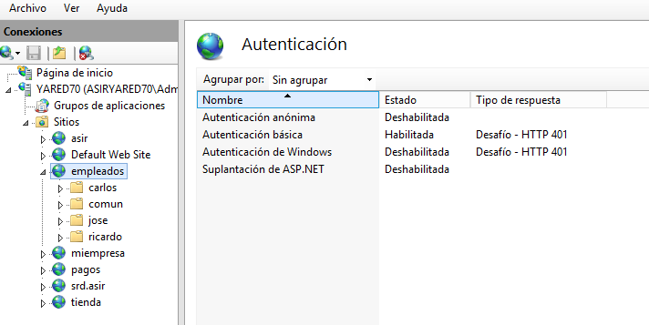

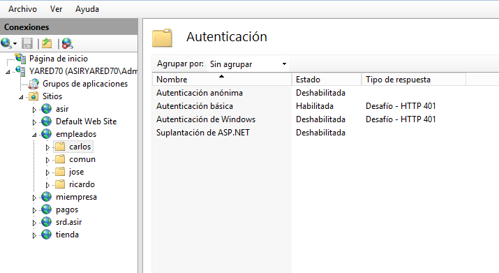

* En Active Directory, crearemos un usuario para cada empleado (tantos como carpetas
personales) y un grupo Empleados que los incluya a todos.

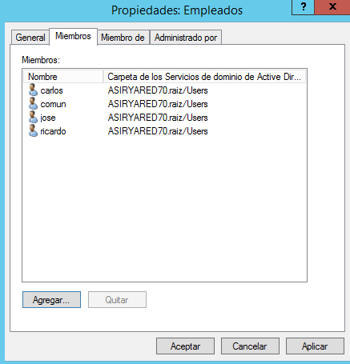

* Configuramos permisos

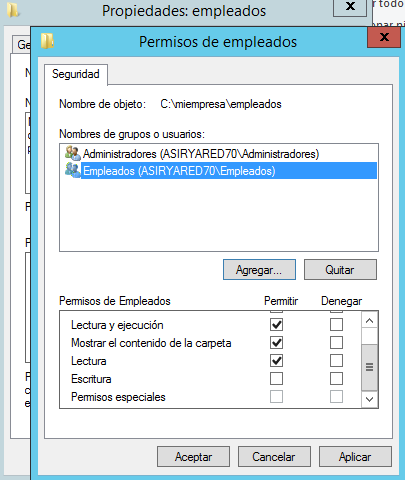

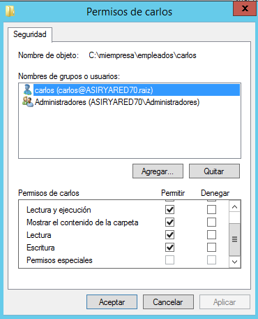

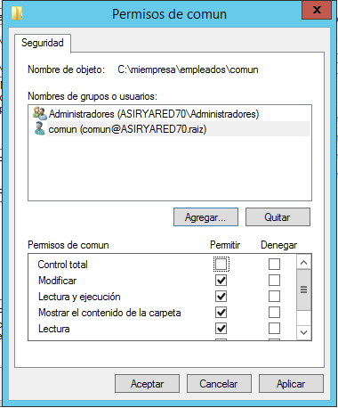

* Comprobamos el acceso, tanto desde el servidor como desde el cliente W7, a las diferentes
carpetas con distintos usuarios.

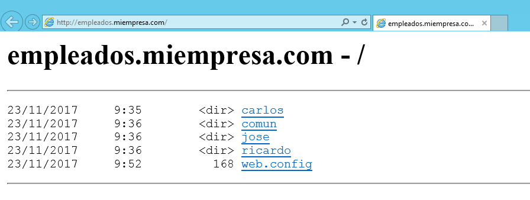

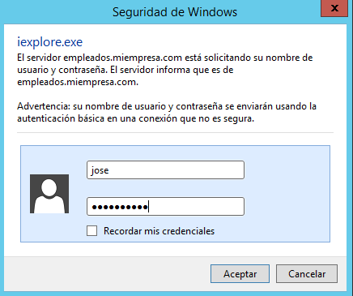

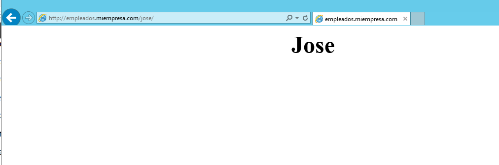
